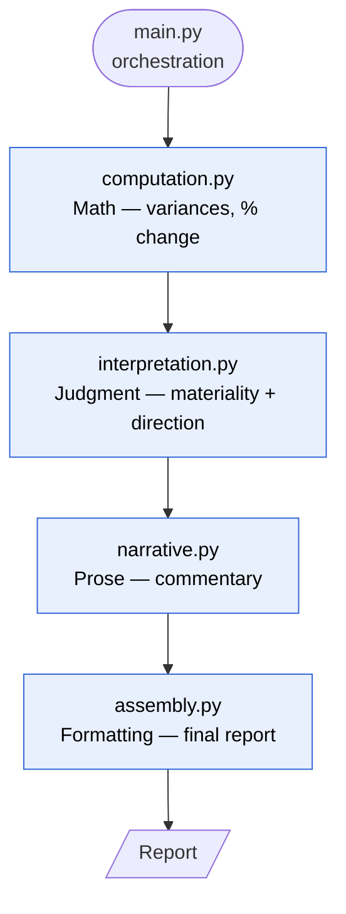

# FNA — Financial Narrative Analyzer

**Audit-traceable variance commentary, generated from your financial data automatically.**

Variance analysis is time-intensive and manual. FNA produces a complete financial narrative from your data instantly — but the part that matters is *how* it does it.

**Computation, materiality, and interpretation are fully deterministic and auditable.** Every sentence in the output traces back to a specific number and a specific rule. If a variance is called "unfavorable," it is because a deterministic rule flagged it — nothing is inferred. The narrative layer only renders conclusions the code has already reached. This boundary is deliberate: when an LLM is introduced (v3), it will phrase results, never decide them.

---

## Example output

<details>
<summary><strong>Click to expand a full generated report</strong></summary>

> **Executive Summary:** ABC Health Services reported higher revenue in Q1 2026 compared with Q1 2025, but overall profitability weakened during the quarter. Revenue growth was offset by higher operating expenses and margin compression, resulting in a slight decline in operating income.
>
> **Revenue Commentary:** Revenue increased from $1,150,000 to $1,250,000, an increase of $100,000 or 8.7%. This was a favorable top-line result and a meaningful positive driver of period performance.
>
> **Gross Profit Commentary:** Gross profit increased from $410,000 to $430,000, up $20,000 or 4.9%. However, gross profit grew more slowly than revenue, and gross margin declined from 35.7% to 34.4%, indicating some pressure on profitability at the gross level.
>
> **Operating Expense Commentary:** Operating expenses increased from $275,000 to $300,000, an increase of $25,000 or 9.1%. Expense growth slightly outpaced revenue growth, which created cost pressure during the quarter. Management notes indicate that labor and software costs contributed to the increase.
>
> **Operating Income Conclusion:** Operating income declined from $135,000 to $130,000, a decrease of $5,000 or 3.7%. The primary reason for the decline was that expense growth and margin pressure more than offset the benefit of higher revenue.
>
> **Key Watchout:** If operating expenses continue growing faster than revenue, profitability could remain under pressure in future periods.

</details>

---

## Architecture

`main.py` orchestrates a four-stage pipeline. Each stage has exactly one responsibility, receives its inputs from `main`, and returns its outputs back to `main` — the deterministic stages run first and fully decide *what is true*; the narrative stage only renders prose.



| Stage | File | Responsibility |
|-------|------|----------------|
| Compute | `computation.py` | Math — variance (actual − prior/budget), % change |
| Interpret | `interpretation.py` | Judgment — attaches account meaning, applies materiality and favorable/unfavorable direction |
| Narrate | `narrative.py` | Prose — renders the already-decided conclusions into commentary |
| Assemble | `assembly.py` | Formatting — builds the final report layout |

All four stages are deterministic in v1. The narrate stage only renders prose from settled conclusions — it cannot change a number or a verdict — which keeps the boundary intact when an LLM is introduced in v3.

---

## Install

```bash
git clone https://github.com/<your-username>/fna.git
cd fna
```

Pure Python standard library — nothing to install. Requires Python 3.

## Usage

```bash
python main.py
```

This runs the pipeline end to end against the example data and prints the report.

The input figures are defined inline near the top of `main.py`. To analyze your own numbers, edit those values directly — each line item carries a prior/budget value and a current/actual value:

```python
# illustrative — match the actual structure in main.py
line_items = [
    {"account": "Revenue",            "prior": 1_150_000, "actual": 1_250_000},
    {"account": "Gross Profit",       "prior":   410_000, "actual":   430_000},
    {"account": "Operating Expenses", "prior":   275_000, "actual":   300_000},
    {"account": "Operating Income",   "prior":   135_000, "actual":   130_000},
]
```

---

## Project structure

```
/
├── main.py            # orchestration — runs the pipeline end to end
├── computation.py     # math — variance (actual − prior/budget), % change
├── interpretation.py  # judgment — account meaning, materiality, direction
├── narrative.py       # prose — generates commentary from settled conclusions
├── assembly.py        # formatting — builds the final report
└── README.md
```

---

## Roadmap

**v1 — Hardcoded rules.** Deterministic computation, materiality, and interpretation live in code. Narrative is generated deterministically from those conclusions. _(current)_

**v2 — Externalized account rules.** Move account rules into a YAML semantic registry so materiality thresholds, favorable/unfavorable direction, and interpretation hints can be edited without touching code:

```yaml
Revenue:
  favorable_when: increase
  min_pct_threshold: 0.05     # 5% relative threshold
  min_abs_threshold: 10000    # $10,000 absolute floor
  interpretation_hint: "Driven by volume or rate; check both."
```

A variance is flagged as material only when it clears **both** the 5% relative threshold **and** the $10,000 absolute floor — so a large percentage swing on a tiny dollar base does not trigger commentary.

**v3 — LLM narrative layer.** Formalize the boundary between the deterministic core and the model: the registry and computation produce a fully-decided set of facts and verdicts, and the model is given only the task of turning that structured object into readable prose.
